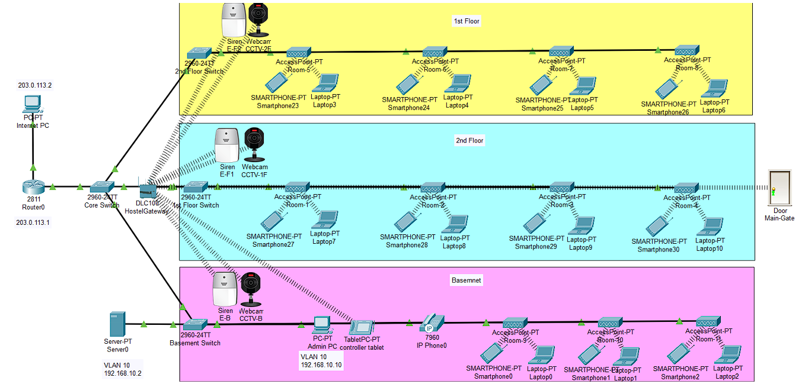
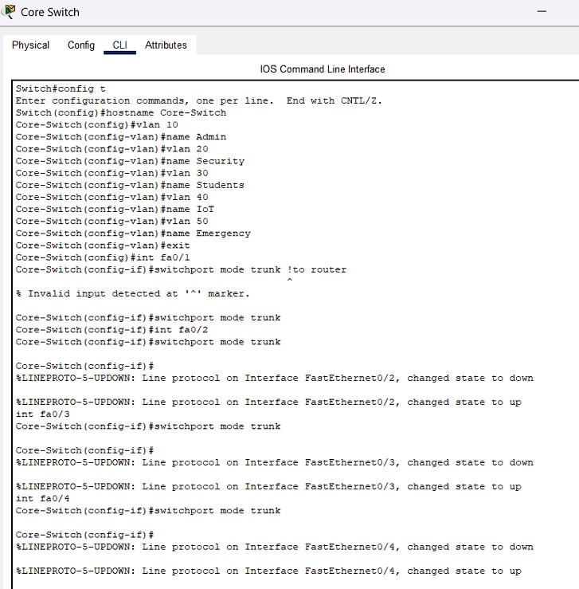
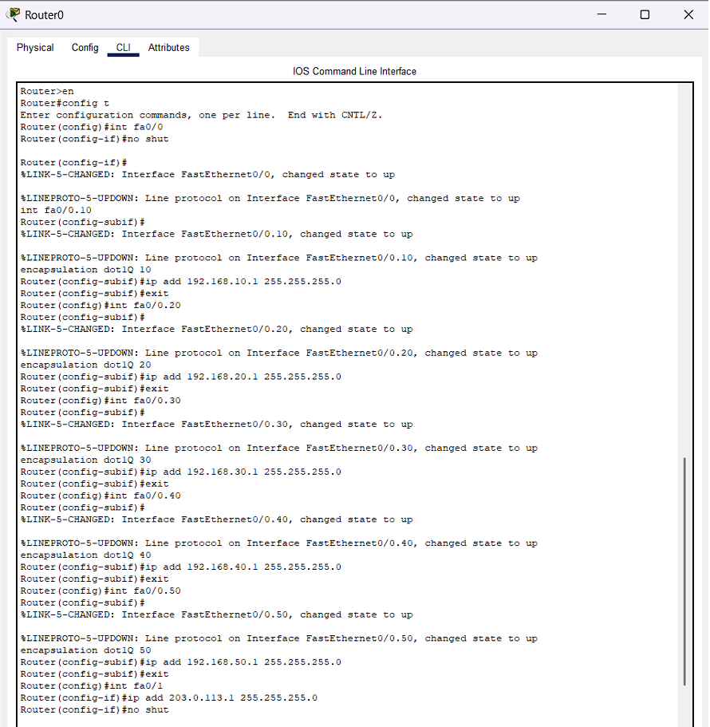
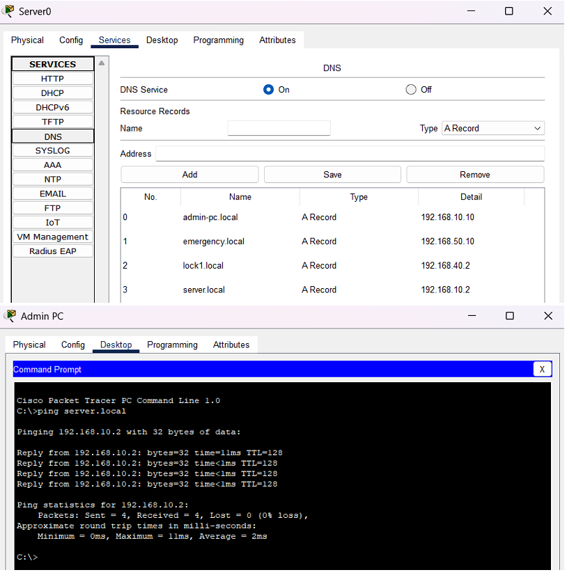
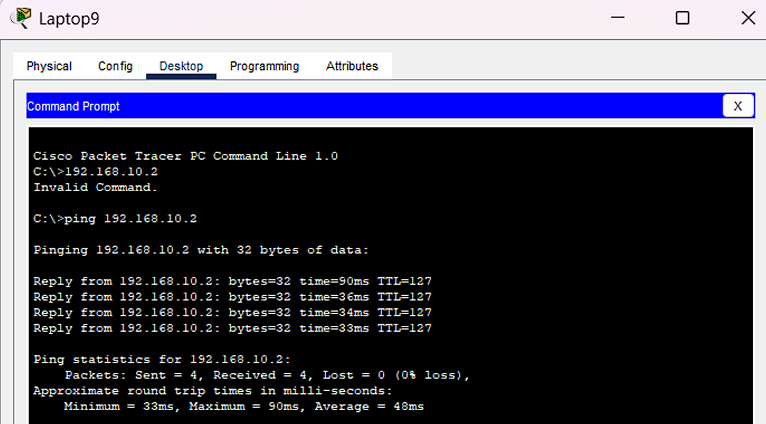
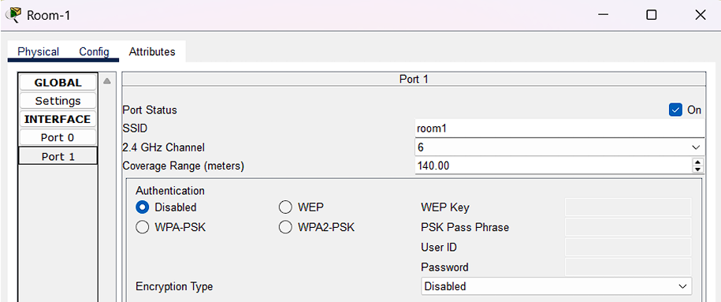

# 🏨 Campus Hostel LAN — Network Simulation Project


> A fully simulated, enterprise-style Local Area Network (LAN) for a multi-floor student hostel, built in Cisco Packet Tracer. Covers VLAN segmentation, inter-VLAN routing, DHCP, NAT, DNS, ACLs, wireless access, and IoT smart devices.

---

## 📋 Table of Contents

- [Overview](#overview)
- [Network Architecture](#network-architecture)
- [Features](#features)
- [VLAN Design](#vlan-design)
- [IP Addressing Scheme](#ip-addressing-scheme)
- [Technologies Used](#technologies-used)
- [Getting Started](#getting-started)
- [Configuration Highlights](#configuration-highlights)
- [Screenshots](#screenshots)
- [Future Improvements](#future-improvements)
- [Author](#author)

---

## Overview

This project simulates a **secure, scalable, and segmented hostel network** for a 3-floor building (Basement + 1st Floor + 2nd Floor). It was designed and implemented as a Computer Networks Lab project at **Capital University of Science and Technology (CUST)**.

The network serves four distinct user groups — admins, security staff, students, and IoT devices — each isolated in their own VLAN to prevent unauthorized access while still sharing common services like DHCP, DNS, and internet via NAT.

**Key challenge solved:** In a real hostel, students, staff, and smart devices all share the same physical infrastructure. Without proper segmentation, any student could reach admin systems or IoT locks. This design prevents that using VLANs + ACLs while keeping the network fully manageable from a single admin server.

---

## Network Architecture

```
Internet (Cloud-PT / Public IP: 203.0.113.2)
        |
   [ Router0 ] — 203.0.113.1 (fa0/1 - NAT Outside)
        |          192.168.x.1 (fa0/0 - NAT Inside, Router-on-a-Stick)
        |
   [ Core Switch ] — Trunk links to all floor switches
     /       |       \
[Basement] [1st Floor] [2nd Floor]
  Switch      Switch      Switch
```

**Physical layout:**
- **Basement** — Admin office (Server + PC), Security room (CCTV monitoring), TabletPC controller, IP Phone
- **1st Floor** — 4 student rooms, each with a wireless access point, laptop + smartphone
- **2nd Floor** — 4 student rooms, same setup as 1st floor
- **IoT Layer** — Smart door lock (main gate), sirens on each floor, CCTV webcams, all managed via HostelGateway

---

## Features

| Feature | Description |
|---|---|
| **VLAN Segmentation** | 5 VLANs isolate Admin, Security, Students, IoT, and Emergency traffic |
| **Inter-VLAN Routing** | Router-on-a-Stick (802.1Q) lets authorized VLANs communicate |
| **DHCP** | Centralized server auto-assigns IPs per VLAN pool |
| **NAT (PAT)** | All internal devices share one public IP for internet access |
| **DNS** | Local name resolution (e.g. `server.local`, `lock1.local`) |
| **ACLs** | Students blocked from Admin VLAN; IoT isolated from main network |
| **Wireless** | Per-room access points (SSID: room1–room8) for student devices |
| **IoT Devices** | Smart door lock, floor sirens, CCTV cameras — all network-controlled |
| **IoT Automation** | TabletPC controls all IoT devices via browser (IoT Server at 192.168.40.2) |
| **CCTV Monitoring** | Webcams on each floor + main entrance feed to security office |

---

## VLAN Design

| VLAN ID | Name | Purpose | Subnet |
|---|---|---|---|
| 10 | Admin | Server, Admin PC, management | 192.168.10.0/24 |
| 20 | Security | CCTV monitoring PCs | 192.168.20.0/24 |
| 30 | Students | Student laptops and smartphones | 192.168.30.0/24 |
| 40 | IoT | Smart locks, sirens, cameras | 192.168.40.0/24 |
| 50 | Emergency | Emergency alert system | 192.168.50.0/24 |

---

## IP Addressing Scheme

| Device | IP Address | VLAN | Notes |
|---|---|---|---|
| Router0 (fa0/1) | 203.0.113.1 | — | Public-facing / NAT Outside |
| Internet PC | 203.0.113.2 | — | Simulates internet host |
| Server0 | 192.168.10.2 | 10 | DHCP + DNS + IoT server |
| Admin PC | 192.168.10.10 | 10 | Static IP |
| HostelGateway (LAN) | 192.168.40.2 | 40 | IoT controller |
| Student devices | 192.168.30.100–199 | 30 | DHCP assigned |
| IoT devices | 192.168.40.x | 40 | DHCP assigned |
| Emergency devices | 192.168.50.x | 50 | DHCP assigned |

**Gateway per VLAN** (Router subinterfaces):
- VLAN 10 → `192.168.10.1`
- VLAN 20 → `192.168.20.1`
- VLAN 30 → `192.168.30.1`
- VLAN 40 → `192.168.40.1`
- VLAN 50 → `192.168.50.1`

---

## Technologies Used

- **Cisco Packet Tracer 8.x** — Network simulation environment
- **Cisco IOS CLI** — Router and switch configuration
- **802.1Q (Dot1Q)** — VLAN trunking protocol
- **DHCP** — Dynamic IP assignment
- **NAT/PAT** — Network Address Translation (overload)
- **DNS** — Local domain name resolution
- **Extended ACLs** — Layer 3 access control
- **IEEE 802.11** — Wireless (Wi-Fi) configuration
- **IoT (Packet Tracer)** — Smart device simulation and automation

---

## Getting Started

### Prerequisites

- [Cisco Packet Tracer](https://www.netacad.com/courses/packet-tracer) 8.0 or higher (free with Cisco NetAcad account)

### Opening the Simulation

1. Clone or download this repository:
   ```bash
   git clone https://github.com/YOUR_USERNAME/campus-hostel-lan.git
   ```

2. Open Cisco Packet Tracer.

3. Go to **File → Open** and select:
   ```
   campus-hostel-lan/simulation/campus_hostel_lan.pkt
   ```

4. The simulation loads automatically. Press the **green Play button** (bottom-left) to enter Realtime mode.

### Exploring the Network

- Click any device → **CLI tab** to view its running configuration
- Click any **PC/Laptop → Desktop → Command Prompt** to run ping/DNS tests
- Open the **TabletPC → Desktop → Web Browser** → navigate to `http://192.168.40.2/home.html` to control IoT devices
- Use **Admin PC → Command Prompt** → `ping server.local` to test DNS resolution

---

## Configuration Highlights

All key IOS configurations are saved as readable text files in the [`/configs`](./configs/) folder. No Packet Tracer needed to read them.

| File | Description |
|---|---|
| [`core_switch.txt`](./configs/core_switch.txt) | VLAN creation + trunk port setup |
| [`basement_switch.txt`](./configs/basement_switch.txt) | VLAN access port assignments |
| [`floor1_switch.txt`](./configs/floor1_switch.txt) | 1st floor student + IoT port config |
| [`floor2_switch.txt`](./configs/floor2_switch.txt) | 2nd floor student port config |
| [`router.txt`](./configs/router.txt) | Subinterfaces, NAT, DHCP helper, ACLs |
| [`dhcp_pools.txt`](./configs/dhcp_pools.txt) | DHCP pool summary per VLAN |
| [`dns_records.txt`](./configs/dns_records.txt) | Local DNS A records |
| [`acl_rules.txt`](./configs/acl_rules.txt) | ACL logic with explanation |

---

## Screenshots

> *Screenshots taken from Cisco Packet Tracer simulation.*

### Network Topology Overview


### VLAN Configuration (Core Switch)


### Inter-VLAN Routing (Router-on-a-Stick)


### DHCP Pools


### NAT Setup + Internet Ping Test


### DNS Resolution


### ACL — Before (Student can reach Admin)


### ACL — After (Student blocked from Admin VLAN)


### Wireless Access Point (Room 1)


### IoT Device Dashboard (TabletPC)


---

## Future Improvements

These are realistic next steps that would strengthen the project:

- [ ] **Add WPA2-PSK** to all wireless access points (currently authentication is disabled — a known security gap)
- [ ] **Implement EIGRP or OSPF** dynamic routing between floors instead of relying solely on the router-on-a-stick
- [ ] **Add a Syslog server** in the Admin VLAN to capture and log network events
- [ ] **NTP synchronization** across all devices using Server0 as the NTP source
- [ ] **Port security** on access switches to limit MAC addresses per port
- [ ] **IPv6 addressing** alongside IPv4 (dual-stack) for future-proofing
- [ ] **QoS (Quality of Service)** to prioritize emergency/CCTV traffic over student traffic
- [ ] **Redundant uplinks** from floor switches to core switch for high availability


## Author

**M. Mansoor Ur Rehman**  

- 📧 mansoorshakeel196@gmail.com
- 💼 https://www.linkedin.com/in/mmansoorurrehman/
- 🐙 https://github.com/imnxr

---

